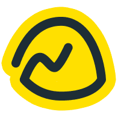
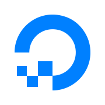
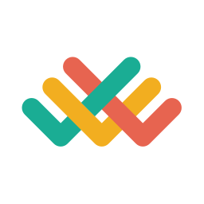
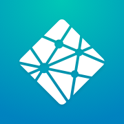
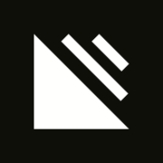

# Beautiful UI/UX References

> ˝Reference examples to help validate UI/UX pattern ideas˝  
> — [Steve Schoger](https://twitter.com/steveschoger)

The initial collection of bookmarks was made by [Steve Schoger](https://twitter.com/steveschoger) in these tweets:

- https://twitter.com/steveschoger/status/1215673997725196288
- https://twitter.com/steveschoger/status/1216412188849725441

Credits go to him and the ones who contributed to the list. Bookmarks are sorted alphabetically.

## Bookmarks

- [&nbsp; Abstract](https://www.abstract.com)
- [&nbsp; Airbnb](https://www.airbnb.com)
- [&nbsp; Algolia](https://www.algolia.com)
- [&nbsp; Asana](https://asana.com)
- [&nbsp; Baremetrics](https://baremetrics.com)
- [&nbsp; Basecamp](https://basecamp.com)
- [&nbsp; Calibre](https://calibreapp.com)
- [&nbsp; Campaign Monitor](https://www.campaignmonitor.com)
- [&nbsp; Digital Ocean](https://www.digitalocean.com)
- [&nbsp; Discord](https://discordapp.com)
- [&nbsp; Dovetail](https://dovetailapp.com)
- [&nbsp; Dropbox](https://www.dropbox.com)
- [&nbsp; Etsy](https://www.etsy.com)
- [&nbsp; Gumroad](https://gumroad.com)
- [&nbsp; Harvest](https://www.getharvest.com)
- [&nbsp; Help Scout](https://www.helpscout.com)
- [&nbsp; Heroku](https://www.heroku.com)
- [&nbsp; Intercom](https://www.intercom.com)
- [&nbsp; Join](https://join.com)
- [&nbsp; Lattice](https://lattice.com)
- [&nbsp; Linear](https://linear.app)
- [&nbsp; Marvel](https://marvelapp.com)
- [&nbsp; Mention](https://mention.com)
- [&nbsp; Mixpanel](https://mixpanel.com)
- [&nbsp; Netlify](https://www.netlify.com)
- [&nbsp; Notion](https://www.notion.so)
- [&nbsp; Opendoor](https://www.opendoor.com)
- [&nbsp; Paddle](https://paddle.com)
- [&nbsp; Polymail](https://polymail.io)
- [&nbsp; Positionly](https://positionly.com)
- [&nbsp; Prismic](https://prismic.io)
- [&nbsp; Rippling](https://www.rippling.com)
- [&nbsp; Segment](https://segment.com)
- [&nbsp; Sentry](https://sentry.io)
- [&nbsp; Shopify](https://www.shopify.com)
- [&nbsp; Simplecast](https://simplecast.com)
- [&nbsp; Stripe](https://stripe.com)
- [&nbsp; Superhuman](https://superhuman.com)
- [&nbsp; Things](https://culturedcode.com/things)
- [&nbsp; Todoist](https://todoist.com)
- [&nbsp; TransferWise](https://transferwise.com)
- [&nbsp; Trello](https://trello.com)
- [&nbsp; Twitch](https://www.twitch.tv)
- [&nbsp; WealthBar](https://www.wealthbar.com)
- [&nbsp; Workable](https://www.workable.com)
- [&nbsp; Zeit](https://www.zeit.co)

## Contributing

You can suggest new bookmarks by opening a pull request.
